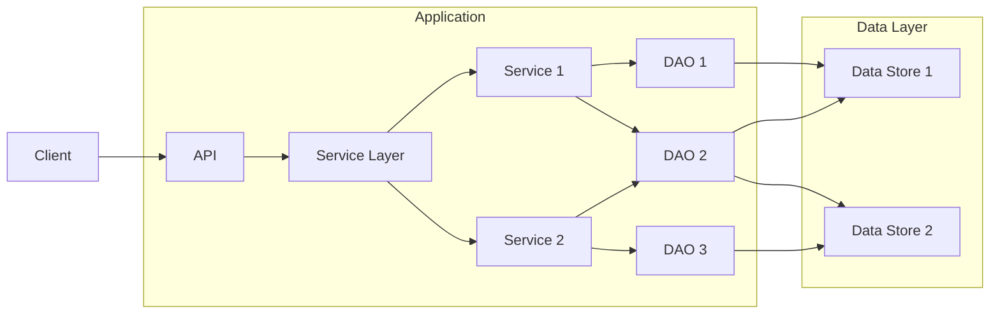

# Typescript Velo

Example project showcasing how to use Typescript with Velo with Jest testing flow.

Site: [Example site](https://krasalgim.wixstudio.io/my-site)


## What do we need from Velo

- [ ] separate build action that would be able to expect output in build directory
- [ ] non-recursive type definition for public and backend folders
- [ ] test-kits for $w and all Velo API's like booking, members, etc.
- [ ] ability to build using Github Actions
    - this requires support for `wix/cli` usage via `API-KEY` for `publish` and `build`

## Setup

For Setting up please use documentation from [setup.md](./setup.md).

## Architecture

General rules:
- adding types leads to easier refactoring and less tests
- adding test for dynamic cases leads for better system resiliency
- types + tests = easy to maintain code

### Backend and Frontend communication

TO make Typescript work with Velo infrastructure I had to introduce few constrain.

1. All backend APIs are exporting to Frontend using single `ServiceLayer.ts` file.
2. Frontend is using `API.ts` to communicate with backend via `ServiceLayer.ts`.
3. All request/responses are wrapped in `Response` object.

All of these constrains are needed so when compiling Typescript, we can easily generate matching `ServiceLayer.jsw` and `API.js` files.
- `ServiceLayer.ts` -> `ServiceLayer.jsw`
- `API.ts` -> `API.js` and updates import of `ServiceLayer.ts` to `ServiceLayer.jsw`



### Frontend components

When building FE components we need to assume we are not working in global environment. This means we need to import $w as part of our dependencies.

```ts
export const App = ($: typeof $w, doSmth: () => any) => {
  const addMore: $w.Button = $("#addMore");
  
  addMore.onClick(doSmth);
};

// We plug our application to global environment
$w.onReady(() => {
  App($w);
});
```

This leads to cleaner design because then we can write isolated test cases

```ts
import { App } from "./App";
import { describe, it, expect, jest } from "@jest/globals";
import { testEnv } from "./fakes/jest.setup";

describe("App", () => {
  it("should do something", () => {
    const $ = testEnv();
    const fakeCall = jest.fn();

    App($w, fakeCall);

    const addMore = $("#addMore");
    
    addMore.click();

    expect(fakeCall).toHaveBeenCalled();
  });
});
```
### Faking the $w

To create code that has quick TDD cycle we need to make test run in less then few seconds. This can be done by creating Snapshot tests or by faking the $w.
Because we don't have access to WixDom while working, we can create fake $w that will be used in tests. As long it "quacks" like a $w we are good to go.
You can find examples tests here: [examples](./tests/exampltes.test.ts)


## Build process

There are few steps that are needed to make Typescript work with Velo.
- we need to use `src` directory as build destination directory and `app` directory as build source directory
- we need to use `tsc` to compile Typescript to Javascript only in cases where we have all the types, so only Produnction code
    - so all the `app` files are compiled to `src` directory
    - all the `tests` files are interpreted using `Babel` so we can run tests
        - small caveat here: tests are not type checked
    - we have multiple `tsconfig.json` files
        - [global tsconfig.json](./tsconfig.json) - used for IDE support and auto-completion
        - [app tsconfig](./app/tsconfig.json) - used for compiling `app` files
    - `jest.config.js` is used to configure `jest` to use `Babel` for tests
    - `babel.config.js` is used to configure `Babel` to use `ts-jest` for tests and mock environemnt
    - `.env.json` and `.env.json.example` is used to add test environment variables to override how testing system works on CI vs local development

## Contributions

- https://github.com/Algiras - Algimantas Krasauskas

If you have any questions or suggestions please open an issue or PR.